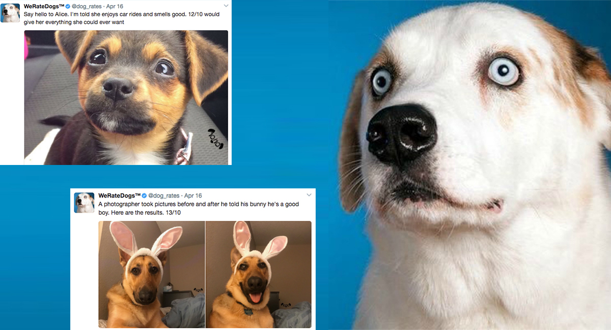

# Wrangle and Analyze Data
### Introduction
We rate dog is a twitter account with funny and interesting tweets of rating dogs
 

### Overview
Project objectives  
The project main objectives were:  
-	Perform data wrangling (gathering, assessing and cleaning) on the provided sources of data. 
-	Store, analyze, and visualize the wrangled data. 
-	Reporting on 
  1.	data wrangling efforts.
  2.	data analyses and visualizations.  
In addition, as per project specificacion, only original tweets/ratings that have images should be used in the analysis (no retweets nor replies).

This project was completed as part of [Udacity](www.udacity.com)'s **Data Analysis Professional Nanodegree**. 
 
### Datasets
- [twitter-archive-enhanced.csv](data/twitter-archive-enhanced.csv) provided from [Udacity](www.udacity.com).
- [image-predictions.tsv](data/image-predictions.tsv) Downloaded from this [link](https://d17h27t6h515a5.cloudfront.net/topher/2017/August/599fd2ad_image-predictions/image-predictions.tsv)
- [tweet_json.txt](data/tweet_json.txt) Gathered from twitter API.
- [twitter_archive_master.db](data/twitter_archive_master.db) database hold the cleaned combined dataset.

### Reports
- [Wrangle report](reports/wrangle_report.pdf): documentation for data wrangling steps: gather, assess, and clean.
- [Act report](reports/act_report.pdf): documentation of analysis and insights into final data.

### Used Tools
- Jupyter notebook
- Python and it's libraries (pandas, numpy, matplotlib, seaborn, requests, tweepy, worldcloud, io, os, PIL, json, sqlalchemy)
- Microsoft Office programms (Excel, Word, Power Point)

### Sources
- Funny youtube [video](https://www.youtube.com/watch?v=ah6fmNEtXFI) to know the difference between ('doggo', 'floofer', 'pupper', 'puppo')
- Reading pandas data frame row by row [Stack over flow](https://stackoverflow.com/questions/16476924/how-to-iterate-over-rows-in-a-dataframe-in-pandas)
- For the word cloud funny image I followed this [tutorial](https://www.datacamp.com/community/tutorials/wordcloud-python) at [DataCamp](www.datacamp.com)

#### Find me in social media

